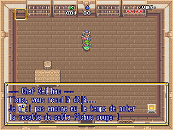

# le grimoire

Le grimoire \(appelé grimoire IGoR dans le jeu icaRius\) se constitue d'une collection de tutoriels établis en Rmarkdown, eux-mêmes réunis sous la forme d'un package FuncampR. La quasi totalité des tutoriels utilisent le package learnr pour proposer des exercices appliqués, dans lequel le stagiaire accède à une console pour apprendre la syntaxe R et exécuter du code en ligne. Certains d'entre eux utilisent en outre le package parsons, pour apprendre à composer les segments d'un traitement en R en les assemblant comme les pièces d'un puzzle. Les tutoriels avec learnr et parsons sont orchestrés en runtime:shiny\_prerendered. _A noter qu'un tutoriel fait exception : dédié à l'apprentissage des méthodes de documentation d'un code, il mobilise le package shinyAce et se trouve orchestré en runtime:shiny \(voir chapitre 12\)._

## Structuration du package

Le package est structuré de la façon suivante :

* répertoire `inst` : il est lui même composé du sous-répertoire `learnr` regroupant l'ensemble des tutoriels, et du sous-répertoire `data` regroupant les fichiers de données utilisées pour les tutoriels. Chaque tutoriel est présenté comme un "chapitre" du grimoire \(et se trouve positionné dans un sous-répertoire de type `chapitreXX`\).
* répertoire `R` : s'y trouve le programme code.R, qui permet :

  -- de scanner l'ensemble des fichiers Rmd éligibles à être proposés comme tutoriel \(fonction `tous_les_programmes()`\)

  -- de lancer un support Rmd \(fonction `launch_learn()`\)

* répertoire `man` : documentation des fonctions citées supra. 

## Fonctionnalités pour les exercices

L'utilisation du package learnr permet de proposer des exercices interactifs, avec une console R intégrée, pour laquelle il est possible de faire apparaître une solution en aide au stagiaire

Des quizz sont également proposés : à la fin de chaque tutoriel, ils permettent de vérifier que le stagiaire a résolu l'énigme, et de lui confirmer la réponse à renseigner dans le jeu icaRius.

Enfin, le package parsons propose des exercices sous forme de "puzzle", mettant l'accent sur le bon ordonnancement des briques d'un traitement.

