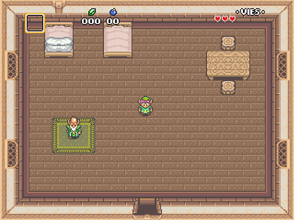
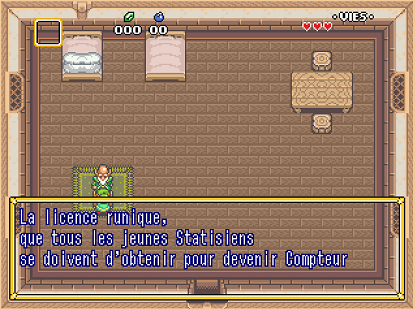
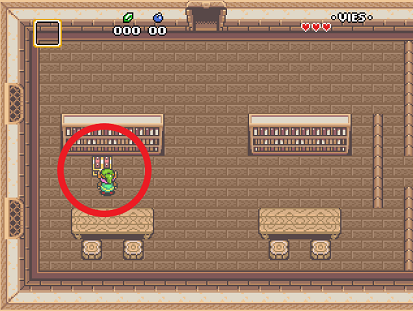
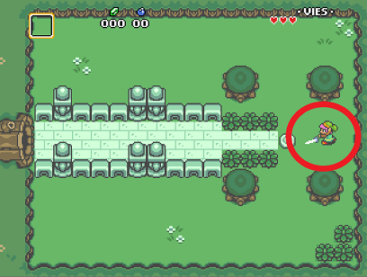
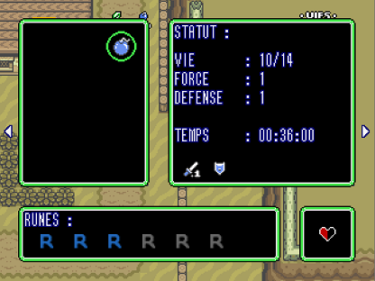

# Les essentiels pour jouer à icaRius

Dans cette partie, nous vous proposons une aide à la prise en main du jeu icaRius : les actions que vous pouvez effectuer, les paramétrages du jeu (écran, musique...) et d'autres astuces encore !

## Les commandes du jeu

Vous voilà au début de votre aventure, et vous découvrez le personnage, icaRius, dans une "vue du dessus". Comment faire pour manipuler ce personnage ? 

Pour déplacer le personnage, utilisez les *flèches directionnelles* de votre clavier (flèches du haut ou du bas pour monter ou descendre, flèches gauche ou droite pour prendre ces directions)

Pour dialoguer avec un autre personnage, mettez vous bien en face de lui et appuyez sur la touche *espace*.

Pour interagir avec un élément du décor (un coffre, une porte), mettez vous bien en face et appuyez sur la touche *espace*.

Pour utiliser votre épée (que vous obtiendrez peu après l'énigme n°1), utilisez la touche *c*. 

Un peu plus tard dans l'aventure, vous obtiendrez de nouveaux équipements. Pour y accéder, appuyez sur la touche *d* du clavier. Un menu apparaît, avec plusieurs informations

- en bas, les runes que vous avez obtenues (en grisée lorsqu'elles sont encore à obtenir, en bleu une fois obtenue) et le nombre de "quart de coeur" obtenu en attendant d'augmenter votre réserve de vie.
- partie en haut à droite, quelques statistiques (eh oui) sur votre partie : point de vie, force, défense, temps de jeu... 
- partie en haut à gauche, un panneau de sélection des équipements. Vous pouvez vous déplacer dans ce panneau avec les flèches directionnelles du clavier. Placez le curseur de sélection (un cercle qui clignote) sur un équipement de votre choix. Appuyez sur la touche x pour sélectionner cet équipement : un cercle entoure l'équipement pour confirmer votre choix. 

Pour quitter ce menu, appuyez sur la touche *d* du clavier. Vous voilà de nouveau dans le jeu. Appuyez sur la touche *x* pour vous servir de votre équipement. 

## Les paramètres (musique, vidéo)

Vous voulez réduire le volume de cette insupportable musique ? Couper les bruitages ? Modifier le rendu visuel du jeu ? Ca se passe ici...

Pendant votre partie, appuyez sur la touche d du clavier pour faire apparaître le menu. Par défaut, vous voyez le panneau avec l'inventaire des équipements et les statistiques du héros. Avec les flèches "gauche" ou "droite" du clavier, vous pouvez changer de panneau : appuyez sur la touche de gauche, jusqu'à voir apparaître le menu "Options du jeu". Ici, vous pouvez modifier trois éléments :

- l'affichage vidéo : vous pouvez agrandir la résolution du jeu, ou encore lisser les pixels pour un rendu "dessin animé".
- la musique : vous pouvez baisser le niveau sonore (de 100, niveau maximal, à 0, son coupé)
- les bruitages : vous pouvez baisser le niveau sonore (de 100, niveau maximal, à 0, son coupé)

A chaque fois, déplacez vous en utilisant les flèches haut et bas du clavier, puis une fois le curseur de sélection en face de l'option à modifier, appuyez sur la touche espace pour chaque changement.

A la fin des modifications, appuyez sur la touche d pour quitter le menu. A noter, la modification est gardée en mémoire, même si vous redémarrez le jeu. Pratique !

## La carte des donjons

A venir

## Sauvegarder sa partie

A tout moment dans le jeu, il est possible de mettre sur pause en appuyant sur la touche "esc. / écha." de votre clavier. Vous avez alors le choix entre : reprendre le jeu après cette pause, sauvegarder la partie et revenir à l'accueil du jeu, revenir à l'accueil du jeu sans sauvegarder.

Attention : la sauvegarde vous permet de revenir à un point proche de votre parcours, en gardant en mémoire les Runes obtenues et les ennemis vaincus, mais pas toujour exactement au moment où vous vous êtes arrêtés (la partie peut reprendre, par exemple, au début du monde concerné).

